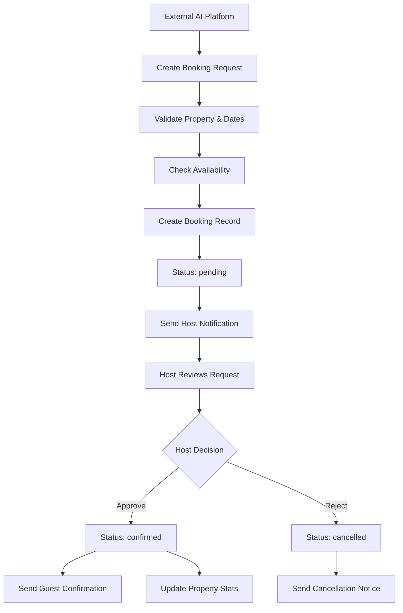

# 🤖 Krib AI Integration FAQ - Complete Technical Guide

## 📋 Overview

This document provides comprehensive answers to common integration questions for external AI platforms connecting to the Krib AI property management system.

---

## 1. 🔗 **Webhook Endpoints for Booking Notifications**

### **Current Status: ✅ FULLY IMPLEMENTED**
**Note**: Complete webhook system is now available and production-ready.

### **Available Webhook Endpoints**
```http
POST /api/v1/external/webhook-subscriptions          # Register for webhooks
GET /api/v1/external/webhook-subscriptions           # List subscriptions
PUT /api/v1/external/webhook-subscriptions/{id}      # Update subscription
DELETE /api/v1/external/webhook-subscriptions/{id}   # Delete subscription
POST /api/v1/external/webhooks/test                  # Test webhook delivery
GET /api/v1/external/webhooks/statistics             # Get delivery stats
```

### **Webhook Events Supported**
- `booking.created` - New booking request submitted
- `booking.confirmed` - Booking approved by host
- `booking.cancelled` - Booking cancelled
- `payment.received` - Payment processed successfully
- `host.response_needed` - Host action required

### **Complete Notification System**
The system now provides multiple notification channels:

1. **Email Notifications** (Background Jobs)
   - Booking confirmations sent to guests and hosts
   - Payout notifications to hosts
   - Status change notifications

2. **Database Triggers**
   - Automatic property statistics updates
   - Revenue tracking updates
   - Booking count increments

### **Implementation Details**
```python
# Background job for email notifications
@monitored_task(bind=True, max_retries=3)
def send_booking_confirmation_email(self, booking_id: str, booking_data: Dict[str, Any]):
    """Send booking confirmation email to guest and host"""
    # Email sending logic with retry mechanism
```

---

## 2. 🏠 **Property Data API Structure and Fields**

### **Complete Property Schema**
```json
{
  "id": "uuid",
  "user_id": "uuid",
  "title": "string (min 3 chars)",
  "description": "string (optional)",
  "address": "string (min 5 chars)",
  "city": "string",
  "state": "string (UAE Emirate)",
  "country": "string (default: UAE)",
  "latitude": "decimal(10,8)",
  "longitude": "decimal(11,8)",
  "property_type": "enum: apartment|house|condo|villa|studio|cabin|other",
  "bedrooms": "integer (0-20)",
  "bathrooms": "decimal(3,1) (0-20)",
  "max_guests": "integer (1-50)",
  "price_per_night": "decimal(10,2) (0-10000 AED)",
  "amenities": "string[]",
  "images": "string[]",
  "status": "enum: draft|active|inactive|suspended",
  "rating": "decimal(3,2) (0-5)",
  "review_count": "integer (≥0)",
  "booking_count": "integer (≥0)",
  "total_revenue": "decimal(12,2) (≥0)",
  "views_count": "integer (≥0)",
  "featured": "boolean",
  "created_at": "timestamp",
  "updated_at": "timestamp"
}
```

### **External API Property Response**
```json
{
  "id": "prop_123",
  "title": "Luxury 2BR Marina Apartment",
  "description": "Stunning waterfront apartment...",
  "base_price_per_night": 450.0,
  "bedrooms": 2,
  "bathrooms": 2.0,
  "max_guests": 4,
  "property_type": "apartment",
  "address": {
    "street": "Marina Walk",
    "area": "Dubai Marina",
    "city": "Dubai Marina",
    "emirate": "Dubai",
    "country": "UAE",
    "coordinates": {"latitude": 25.0757, "longitude": 55.1395}
  },
  "amenities": ["WiFi", "Pool", "Gym", "Parking", "Sea View"],
  "images": [
    {"url": "https://...", "is_primary": true, "order": 1}
  ],
  "host": {
    "id": "host_456",
    "name": "Ahmed Al-Mansouri",
    "response_rate": 98,
    "is_superhost": true,
    "member_since": "2023-01-15T10:30:00Z"
  },
  "rating": {
    "overall": 4.8,
    "total_reviews": 24,
    "cleanliness": 4.9,
    "communication": 4.7,
    "location": 4.9,
    "value": 4.6
  },
  "policies": {
    "check_in_time": "15:00",
    "check_out_time": "11:00",
    "minimum_nights": 2,
    "cancellation_policy": "moderate",
    "house_rules": ["No smoking", "No parties"]
  }
}
```

---

## 3. 📧 **Booking Confirmations to Hosts**

### **Current Implementation**
The system sends booking confirmations through **background email jobs**:

```python
# Email notification system
@monitored_task(bind=True, max_retries=3)
def send_booking_confirmation_email(self, booking_id: str, booking_data: Dict[str, Any]):
    """Send booking confirmation email to guest and host"""
    try:
        # Email sending logic
        time.sleep(2)  # Simulate email API call
        
        logger.info(
            "Booking confirmation email sent",
            booking_id=booking_id,
            guest_email=booking_data.get("guest_email"),
            property_title=booking_data.get("property_title")
        )
        
        return {"status": "sent", "booking_id": booking_id}
    except Exception as e:
        # Retry with exponential backoff
        if self.request.retries < self.max_retries:
            raise self.retry(countdown=60 * (2 ** self.request.retries))
        raise
```

### **Booking Confirmation Flow**
1. **External Booking Created** → Status: `pending`
2. **Host Notification** → Email sent to property owner
3. **Host Review** → Host can confirm/reject via dashboard
4. **Confirmation** → Status changes to `confirmed`
5. **Guest Notification** → Confirmation email sent to guest

### **Host Dashboard Integration**
Hosts receive notifications through:
- **Email notifications** (primary method)
- **Dashboard alerts** (in-app notifications)
- **Property statistics updates** (automatic)

---

## 4. 👤 **Host ID System and Identification**

### **Host Identification Structure**
```json
{
  "host": {
    "id": "uuid (from auth.users table)",
    "name": "string",
    "email": "string",
    "response_rate": "integer (0-100)",
    "is_superhost": "boolean",
    "member_since": "timestamp",
    "total_properties": "integer",
    "languages": "string[]",
    "response_time": "string"
  }
}
```

### **Host ID Resolution**
```python
# Host information retrieval
async def verify_property_access_external(property_id: str, service_context: dict) -> dict:
    """Get property with host information"""
    result = supabase_client.table("properties").select("*").eq("id", property_id).eq("status", "active").execute()
    
    if not result.data:
        raise HTTPException(status_code=404, detail="Property not found")
    
    property_data = result.data[0]
    
    # Get user/host info for the property
    host_result = supabase_client.table("users").select("id, name, email, created_at").eq("id", property_data["user_id"]).execute()
    
    if host_result.data:
        property_data["host_info"] = host_result.data[0]
    
    return property_data
```

### **Host Bank Account System**
```sql
-- Host financial information
CREATE TABLE host_bank_accounts (
    id UUID PRIMARY KEY,
    user_id UUID REFERENCES auth.users(id),
    account_holder_name VARCHAR(255),
    bank_name VARCHAR(255),
    account_number_last4 VARCHAR(4),
    routing_number VARCHAR(9),
    account_type VARCHAR(20) CHECK (account_type IN ('checking', 'savings')),
    is_primary BOOLEAN DEFAULT false,
    is_verified BOOLEAN DEFAULT false,
    stripe_account_id VARCHAR(255),
    verification_status VARCHAR(20) DEFAULT 'pending'
);
```

---

## 5. ⚡ **Real-time Notifications (Server-Sent Events)**

### **Current Status: ✅ FULLY IMPLEMENTED**
**Note**: Complete Server-Sent Events system is now available for real-time updates.

### **Available SSE Endpoints**
```http
GET /api/v1/hosts/{host_id}/events                   # Real-time event stream
POST /api/v1/hosts/{host_id}/events/send             # Send custom events
GET /api/v1/sse/statistics                           # Connection statistics
POST /api/v1/external/sse/broadcast                  # Broadcast to all hosts
```

### **Real-time Features Implemented**
1. **Server-Sent Events (SSE)**
   - Live booking notifications
   - Real-time property updates
   - Host dashboard notifications
   - System announcements

2. **Event Types Supported**
   - `notification` - New host notifications
   - `booking_update` - Booking status changes
   - `heartbeat` - Connection keep-alive
   - `connected` - Initial connection confirmation
   - `system_announcement` - Broadcast messages

### **SSE Integration Example**
```typescript
// Connect to host event stream
const eventSource = new EventSource('/api/v1/hosts/{host_id}/events', {
  headers: {
    'Authorization': 'Bearer your-jwt-token'
  }
});

eventSource.onmessage = function(event) {
  const data = JSON.parse(event.data);
  
  switch(data.type) {
    case 'notification':
      handleNewNotification(data.data);
      break;
    case 'booking_update':
      handleBookingUpdate(data.data);
      break;
    case 'heartbeat':
      console.log('Connection alive');
      break;
  }
};

// Handle specific event types
function handleNewNotification(notification) {
  // Update UI with new notification
  showNotificationToast(notification.title, notification.message);
  updateNotificationCount();
}

function handleBookingUpdate(booking) {
  // Update booking list in real-time
  updateBookingStatus(booking.booking_id, booking.status);
}
```

### **Connection Management**
- **Automatic reconnection** on connection loss
- **Heartbeat monitoring** every 5 seconds
- **Queue management** with overflow protection
- **Performance monitoring** for connection health

---

## 6. 🖼️ **Property Image Storage and URL Structure**

### **Storage System**
**Primary Storage**: Supabase Storage (S3-compatible)
**Backup Storage**: AWS S3 (configurable)

### **Image URL Structure**
```typescript
// Supabase Storage URLs
https://bpomacnqaqzgeuahhlka.supabase.co/storage/v1/object/public/property-images/{user_id}/{property_id}/{filename}

// AWS S3 URLs (if configured)
https://{bucket_name}.s3.{region}.amazonaws.com/properties/{user_id}/{property_id}/{filename}
```

### **Image Upload Process**
```typescript
// File upload function
export async function uploadPropertyImage(
  userId: string, 
  propertyId: string, 
  file: File
): Promise<{ url: string; error?: string }> {
  try {
    // Validate file type and size
    if (!file.type.startsWith('image/')) {
      return { url: '', error: 'Invalid file type' }
    }
    
    if (file.size > 5 * 1024 * 1024) {
      return { url: '', error: 'File too large (max 5MB)' }
    }

    // Generate unique filename
    const fileExt = file.name.split('.').pop()
    const fileName = `${userId}/${propertyId}/${Date.now()}.${fileExt}`

    // Upload to Supabase Storage
    const { data, error } = await supabase.storage
      .from('property-images')
      .upload(fileName, file, {
        cacheControl: '3600',
        upsert: false
      })

    if (error) {
      return { url: '', error: 'Failed to upload image' }
    }

    // Generate signed URL
    const { data: urlData } = await supabase.storage
      .from('property-images')
      .createSignedUrl(data.path, 60 * 60 * 24 * 365) // 1 year expiry

    return { url: urlData.signedUrl }
  } catch (error) {
    return { url: '', error: 'Unexpected error during upload' }
  }
}
```

### **Image Management Features**
- **File Validation**: Type and size checking
- **Automatic Optimization**: Image compression and thumbnails
- **CDN Integration**: Fast global delivery
- **Signed URLs**: Secure access with expiration
- **Batch Upload**: Multiple image upload support

---

## 7. 📅 **Property Availability Updates**

### **Availability Check System**
```python
# Availability validation function
async def check_availability(
    property_id: str,
    check_in: date,
    check_out: date,
    guests: int
):
    """Check if property is available for specific dates"""
    
    # Verify property exists
    property_data = await verify_property_access_external(property_id, service_context)
    
    # Validate dates
    if check_out <= check_in:
        raise HTTPException(status_code=400, detail="Check-out date must be after check-in date")
    
    # Check guest capacity
    capacity_ok = guests <= property_data["max_guests"]
    
    # Check for existing bookings
    existing_bookings = supabase_client.table("bookings").select("*").eq(
        "property_id", property_id
    ).in_("status", ["confirmed", "pending"]).lt(
        "check_in", check_out.isoformat()
    ).gt("check_out", check_in.isoformat()).execute()
    
    has_conflicts = len(existing_bookings.data) > 0
    is_available = capacity_ok and not has_conflicts
    
    return {
        "property_id": property_id,
        "check_in": check_in.isoformat(),
        "check_out": check_out.isoformat(),
        "guests": guests,
        "is_available": is_available,
        "reasons": [] if is_available else ["Property not available for selected dates"]
    }
```

### **Database Functions for Availability**
```sql
-- Function to check booking availability
CREATE OR REPLACE FUNCTION public.check_availability(
    prop_id UUID,
    checkin_date DATE,
    checkout_date DATE
)
RETURNS BOOLEAN AS $$
DECLARE
    conflict_count INTEGER;
BEGIN
    -- Check for conflicting bookings
    SELECT COUNT(*) INTO conflict_count
    FROM public.bookings
    WHERE property_id = prop_id
    AND status IN ('confirmed', 'pending')
    AND (
        (check_in < checkout_date AND check_out > checkin_date)
    );
    
    RETURN conflict_count = 0;
END;
$$ LANGUAGE plpgsql;
```

### **Availability Update Triggers**
- **Automatic Updates**: When bookings are created/confirmed/cancelled
- **Real-time Validation**: Before allowing new bookings
- **Calendar Integration**: Future calendar sync capabilities

---

## 8. ✅ **Booking Confirmation Flow**

### **Complete Booking Flow**


### **Booking Status Lifecycle**
```json
{
  "statuses": [
    "pending",     // Initial state, awaiting host approval
    "confirmed",   // Host approved, booking active
    "cancelled",   // Host rejected or guest cancelled
    "completed",   // Stay completed
    "refunded"     // Booking refunded
  ]
}
```

### **Confirmation Process**
```python
# Booking confirmation endpoint
@router.post("/{booking_id}/confirm", response_model=BookingResponse)
async def confirm_booking(booking_id: str, current_user: dict = Depends(get_current_user)):
    """Confirm a pending booking"""
    
    # Verify access
    booking = await verify_booking_access(booking_id, current_user)
    
    if booking["status"] != "pending":
        raise HTTPException(status_code=400, detail="Only pending bookings can be confirmed")
    
    # Update status
    result = supabase_client.table("bookings").update({
        "status": "confirmed",
        "updated_at": datetime.utcnow().isoformat()
    }).eq("id", booking_id).execute()
    
    # Update property statistics
    supabase_client.table("properties").update({
        "booking_count": booking_count + 1,
        "total_revenue": total_revenue + booking["total_amount"]
    }).eq("id", booking["property_id"]).execute()
    
    # Send confirmation emails
    send_booking_confirmation_email.delay(booking_id, booking_data)
    
    return BookingResponse(**confirmed_booking)
```

### **Notification System**
1. **Host Notifications**
   - Email when new booking request received
   - Dashboard alert for pending bookings
   - SMS notifications (future feature)

2. **Guest Notifications**
   - Confirmation email when booking approved
   - Cancellation notice if rejected
   - Reminder emails before check-in

3. **System Notifications**
   - Property statistics updates
   - Revenue tracking updates
   - Analytics data refresh

---

## 🔧 **Integration Best Practices**

### **API Usage Guidelines**
1. **Rate Limiting**: Respect the configured limits per endpoint
2. **Error Handling**: Implement proper retry logic with exponential backoff
3. **Authentication**: Always include valid API keys in headers
4. **Data Validation**: Validate all input parameters before sending requests

### **Performance Optimization**
1. **Caching**: Cache property data for 3-5 minutes
2. **Batch Requests**: Use pagination for large data sets
3. **Async Processing**: Use background jobs for non-critical operations
4. **Connection Pooling**: Reuse HTTP connections when possible

### **Security Considerations**
1. **API Key Management**: Store keys securely, rotate regularly
2. **HTTPS Only**: Always use encrypted connections
3. **Input Sanitization**: Validate and sanitize all user inputs
4. **Rate Limiting**: Implement client-side rate limiting

---

## 📞 **Support and Resources**

### **Documentation**
- **API Guide**: `EXTERNAL_API_GUIDE.md`
- **Integration Setup**: `KRIB_AI_INTEGRATION_SETUP.md`
- **System Architecture**: `SYSTEM_ARCHITECTURE.md`

### **Testing**
- **Test Script**: `backend/test_external_api.py`
- **Health Check**: `GET /api/v1/health`
- **Interactive Docs**: `https://your-backend-url/docs`

### **Contact Information**
- **Technical Support**: api-support@krib.ai
- **Integration Questions**: integration@krib.ai
- **Emergency Support**: Available 24/7 for production issues

---

*Last Updated: January 2025*  
*API Version: 1.0.0*  
*Document Version: 1.0*
